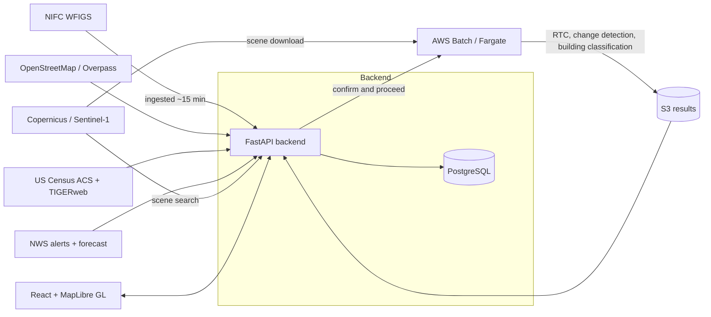

# WildfireDashboard

A live dashboard tracking active US wildfires — estimating exposed buildings
and population at three buffer distances, surfacing a priority score to
identify which fires most warrant a closer look, and dispatching real
Sentinel-1 SAR compute to assess burn extent and building damage once a
human confirms it. Built as a portfolio project for an ICEYE GIS
Operational Analyst application — **not an operational emergency response
tool.**

**Live app**: https://d3qmrxoydtsnh7.cloudfront.net
**API docs**: https://wildfiredashboard-production.up.railway.app/docs

## Contents

- [At a glance](#at-a-glance)
- [What this is, and why](#what-this-is-and-why)
- [Architecture](#architecture)
- [SAR methodology highlights](#sar-methodology-highlights)
- [Data sources](#data-sources)
- [Status](#status)
- [Local development](#local-development)
- [Further reading](#further-reading)

## At a glance

- **Live exposure analysis** for every currently-tracked NIFC wildfire —
  buildings and population within the perimeter, 500m, 1,000m, and 2,400m
  bands, refreshed on a real ingestion/recompute cycle, not a one-off script.
- **A real priority score**, not just a sorted list — combines building
  exposure, fire scale, containment, and active fire-weather warnings into
  a single 0-100 ranking, reworked mid-project after live data showed the
  original weighting under-valuing building count (see
  [SAR methodology highlights](#sar-methodology-highlights)).
- **A genuine human-in-the-loop SAR workflow**: browse real live Sentinel-1
  scene candidates for a fire, pick before/after scenes yourself, confirm,
  and real compute dispatches on AWS Batch — RTC processing, change
  detection, and building-damage classification, not a canned demo result.
- **An adaptive, dual-threshold damage classification** that computes a
  per-fire Otsu threshold from the fire's own signal alongside a fixed
  cross-fire reference value, and flags disagreement rather than hiding it
  — confirmed on real data to matter: a large Colorado fire's two
  thresholds disagreed on roughly half its comparably-classified buildings.
- **Per-fire analyst notes** — timestamped commentary tied to any fire,
  independent of whether it's ever been SAR-assessed.
- Honest about its own limits throughout — population estimates, building
  coverage gaps, and SAR classification confidence are all stated plainly,
  not glossed over, both in the UI and in the docs below.

## What this is, and why

Most open wildfire tools stop at "where is the fire." This one adds what
actually matters for prioritization: what's *exposed* — which buildings and
how many people sit near or inside a fire's perimeter — and, for the fires
that matter most, an actual SAR-based damage assessment rather than just a
perimeter outline.

It's also a deliberately different kind of build from the rest of this
portfolio's work (SAR flood mapping, deforestation monitoring, other batch
analytical pipelines): a genuine live web app, not a one-off analysis
script. That's on purpose — it demonstrates API design, a real
frontend/backend split, cloud deployment, and a live human-in-the-loop
operational workflow, alongside the geospatial-analysis depth the rest of
the portfolio already covers.

## Architecture



- **Frontend**: React + Vite, MapLibre GL JS — S3 + CloudFront.
- **Backend**: FastAPI (Python) — Railway. Background ingestion/exposure/
  alerts/SAR-status loops run as `asyncio` tasks inside the same process,
  not a separate worker — proportionate at this project's scale, not a
  shortcut (see `DECISIONS.md`).
- **Database**: PostgreSQL, JSONB geometry columns + shapely for spatial
  math — see `DECISIONS.md` for why PostGIS wasn't used despite being
  available.
- **SAR compute**: a self-contained Docker image (`sar-compute/`) run as a
  one-shot AWS Batch job per confirmed acquisition — pyroSAR/SNAP for
  radiometric terrain correction, numpy/rasterio/geopandas for change
  detection and classification. Genuinely separate from this repo's web
  app - it only receives a fire ID and fetches everything else from the
  backend's own public API.

## SAR methodology highlights

The full reasoning lives in the app's own [Reference page](https://d3qmrxoydtsnh7.cloudfront.net/reference)
and in `SAR_METHODOLOGY.md`/`SAR_PIPELINE_REDESIGN.md` — this is the
condensed version of what's actually non-obvious about it:

- **This is a damage assessor for a known fire, not a fire detector.**
  Fire location and timing come entirely from NIFC; nothing in the SAR
  signal itself distinguishes fire-caused change from, say, snowmelt or
  seasonal vegetation change elsewhere in the same scene. That's not a
  shortcut unique to this project — real operational systems mostly work
  the same way, since "is a fire happening, here, right now" is usually
  solved by an entirely different sensor family (thermal-anomaly
  detection), with SAR/optical dispatched afterward to assess an
  already-known location.
- **Adaptive threshold, not a single borrowed constant.** Each fire gets
  its own Otsu-derived threshold, computed from that fire's own
  change-image statistics with no ground truth needed - it's the primary,
  headline result. A fixed reference value (inherited from an earlier,
  differently-validated pipeline) still runs alongside it as a stable
  cross-fire comparison point and the automatic fallback when a fire's own
  signal has no clean split to adapt to.
- **Spatial corroboration, not a lone-pixel read.** A building's threshold-
  crossing reading only counts as "destroyed" if it's backed by a real,
  minimum-mapping-unit-surviving burn patch nearby - otherwise it's
  downgraded to a distinct "unconfirmed" class, not silently asserted or
  silently dropped.
- **No spatial despeckling filter, by design.** Sentinel-1's ~20m
  resolution means a typical house is often smaller than a single pixel;
  a spatial noise filter would blend a building's own marginal signal into
  unrelated ground. Noise reduction here is temporal (multi-date median
  compositing) and spatial-corroboration-based, not a pixel-neighborhood
  filter.
- **Every real bug found on real runs is logged, not just fixed silently**
  — a perimeter-clipping bug that once let out-of-perimeter buildings read
  as "destroyed," a z-order bug muting classification colors on the map, a
  small-building sampling gap rescued with a narrowly-scoped retry. See
  `PROGRESS.md` for the full, dated trail.

## Data sources

- **Fire perimeters** — [NIFC WFIGS Current Interagency Fire Perimeters](https://data-nifc.opendata.arcgis.com/datasets/nifc::wfigs-current-interagency-fire-perimeters), refreshed ~every 15 minutes. US only.
- **Building footprints** — OpenStreetMap via the Overpass API.
- **Population estimates** — US Census Bureau: [TIGERweb](https://tigerweb.geo.census.gov/) block group boundaries + [ACS 5-Year](https://www.census.gov/data/developers/data-sets/acs-5year.html) population, redistributed across each block group's real mapped buildings (dasymetric weighting), not spread evenly by land area.
- **Fire-weather alerts + forecast** — [NWS API](https://www.weather.gov/documentation/services-web-api), free, no key required.
- **SAR scenes** — [Copernicus Data Space Ecosystem](https://dataspace.copernicus.eu/), Sentinel-1 IW GRD, searched live.

Full plain-language methodology, including the real accuracy tradeoffs of
each of the above, is on the app's [Reference page](https://d3qmrxoydtsnh7.cloudfront.net/reference).

## Status

- **Exposure/impact (buildings, population, priority score)**: live,
  fully working, no known open gaps.
- **SAR acquisition workflow**: live end-to-end — real Sentinel-1 scene
  search and picker, real AWS Batch/Fargate compute dispatch, real
  completed runs. Gone through several rounds of hardening since first
  shipping (adaptive thresholding, spatial corroboration, a small-building
  sampling fix, figure/output redesign) as real runs surfaced real
  methodology gaps - see `PROGRESS.md` for the dated history.
- **Per-fire analyst notes**: live.
- **RTC processing** (SNAP/GPT) is the dominant per-scene cost in
  wall-clock time - a few concrete, low-cost speedups (thread tuning,
  parallelizing scene processing) are identified but deliberately not yet
  built, since this project runs a handful of demo fires, not a
  production volume. See `PROGRESS.md`'s backlog.
- **Wind/fuel-spread risk modeling**: documented as a future direction,
  not started - a genuine research-scale problem, not a quick add.

## Local development

```bash
# Backend
cd backend
python -m venv .venv
.venv/Scripts/activate  # or source .venv/bin/activate on macOS/Linux
pip install -r requirements.txt
uvicorn app.main:app --reload

# Frontend (separate terminal)
cd frontend
npm install
npm run dev
```

Copy `.env.example` to `.env` at the repo root and fill in `DATABASE_URL`
(a Postgres instance — Railway or local) at minimum. The `sar-compute/`
image is self-contained and documented separately (see its own
`Dockerfile`) - not part of normal local frontend/backend development.

## Further reading

- [Reference page](https://d3qmrxoydtsnh7.cloudfront.net/reference) — the
  live, plain-language methodology + data-source page shown in the app
  itself, including a full literature-cited "why the SAR pipeline is
  built this way" section.
- `PROGRESS.md` — step-by-step build checklist and a dated history of
  every real bug found and fixed, not just what's currently done.
- `DECISIONS.md` — every design decision with real alternatives
  considered, the reasoning, and why each call was made.
- `SAR_METHODOLOGY.md` / `SAR_PIPELINE_REDESIGN.md` — the deep-dive SAR
  research and methodology redesign work behind the summary above.
